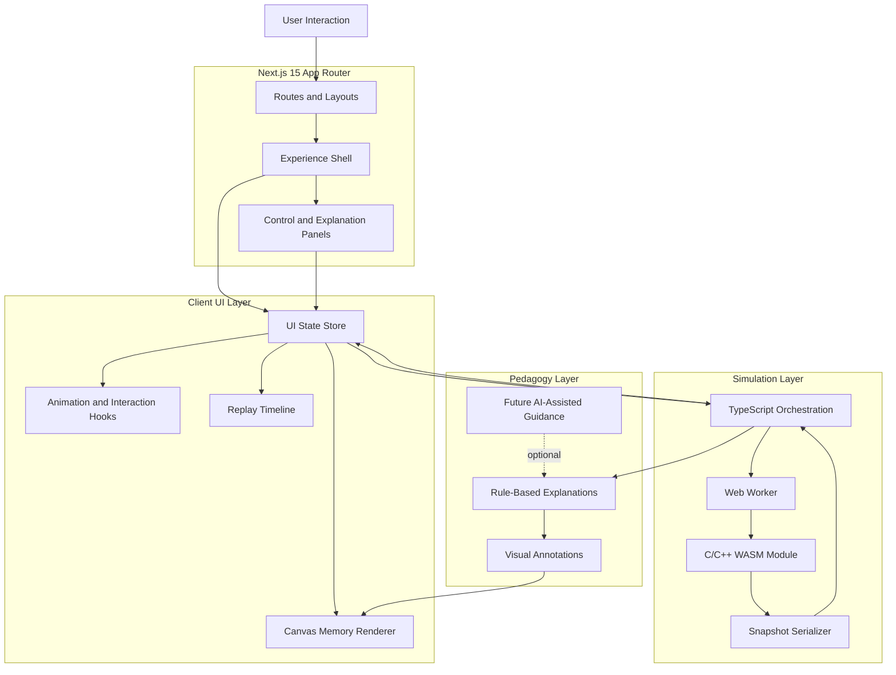

# System Architecture Document

## Executive Summary

VisualizeIT is a modular web platform for interactive technical visualization. The first MVP is the Low-Level Memory Engine, a browser-based learning experience that simulates C memory operations and renders them as an annotated, replayable visual timeline.

The architecture separates simulation, rendering, pedagogy, and UI state. This separation keeps the MVP understandable, testable, and extensible while avoiding a common portfolio-project failure: mixing animation code with domain logic.

## Architectural Principles

- **Simulation is deterministic:** the same input program and operation sequence must produce the same memory timeline.
- **Rendering is replaceable:** simulation snapshots should not depend on React, Canvas, or Three.js.
- **Pedagogy is layered:** explanations annotate simulation state but do not mutate the simulation engine.
- **Performance is measurable:** the app should define frame, interaction, and memory budgets.
- **Future modules are isolated:** IPv6, discrete math, and XAI should plug into the same shell without sharing domain internals.

## Primary Runtime Layers

### 1. Experience Shell

The Next.js App Router owns top-level routing, layouts, metadata, and future module navigation. It should expose one first-class MVP route for the memory engine and leave future modules as documented expansion entries until implemented.

### 2. UI Orchestration Layer

React components own controls, panels, tabs, selected objects, and user interaction. They do not calculate memory behavior directly. They consume simulation snapshots and dispatch user commands.

### 3. Simulation Core

The simulation core models stack frames, heap blocks, pointers, structs, arrays, and memory operations. In the MVP, TypeScript can host orchestration and validation, while C/C++ compiled to WASM can handle deterministic low-level simulation routines.

### 4. WASM Boundary

The WASM module should expose a small API. It should not leak implementation details into React. Data crossing the boundary should be compact, structured, and versioned.

Examples:

- Initialize simulation.
- Apply operation.
- Export snapshot.
- Reset simulation.
- Retrieve diagnostics.

### 5. Rendering Layer

Canvas renders memory maps, stack frames, heap blocks, pointer arrows, operation highlights, and timeline states. Framer Motion supports UI transitions and non-critical microinteractions.

### 6. Pedagogy Layer

The pedagogy layer converts simulation events into concise explanations, annotations, warnings, and guided steps. Future AI-assisted explanations can operate here, outside the deterministic simulation loop.

## Mermaid Architecture Diagram

## Data Flow

1. The user selects or steps through a memory operation.
2. The UI dispatches a command to the simulation orchestrator.
3. The simulation layer applies the operation through TypeScript and/or WASM.
4. The snapshot serializer returns a stable memory state.
5. The UI store updates the active snapshot and timeline.
6. Canvas renders the visual memory layout.
7. The pedagogy layer attaches explanations and warnings.

## AI-Augmented Boundary

AI assistance is allowed for explanations, summaries, guided hints, and future adaptive learning flows. It must not be required for correctness. The simulation engine remains deterministic and testable without any LLM dependency.
